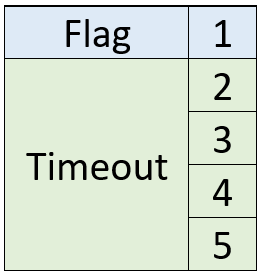

+++
title = "C++ Struct memory alignment"
date = 2012-11-26
keywords = ["C++", "Performance", "Compilers", "Memory"]
description = "Understanding pragma pack preprocessor directive and how it affects to memory alignment"
lang = "en"
aliases = ["langs/en/posts/cpp-pragma-pack"]
+++

A C++ struct is an element that groups attributes with different types so we can manipulate them all together using same reference. It is like a class with public visibility by default for functions and attributes.

If we want to work in a lower level, closer to machine, it might be useful to understand how that data structure is stored in memory and how to control that mapping.

## Struct example

It has two attributes: an integer (4 bytes) and a boolean (1 byte).

```cpp
struct SampleStruct {
    bool flag;
    unsigned int timeout;
};
```

If we get the instance size using `sizeof` we should get 5 bytes size and memory would be like:



**But** is not that simple, memory alignment depends on compiler and system. We will learn how to control compiler alignment policy, so we can avoid getting unexpected allocation memory sizes.

For example, in my local host, if I get the `sizeof` the previous structure without `pragma` declarations, **I get a 8 bytes size**. We are getting 8 Bytes instead of expected 5 Bytes because the compiler allocates more memory at the end of structure so it fits in 2n bytes blocks. Memory actually looks like:


Example output:

```bash
SampleStruct
flag: 1 Bytes
+
timeout: 4 Bytes
=
5 Bytes
sizeof struct:  8 Bytes
--
```

TIP: If we want to know the exact structure size we have to specify compiler how to align the memory, to do so we have `#pragma pack(n)` directive.

## `#pragma pack` directive in C++ struct

It is a preprocessor directive to indicate to compiler how to align data in memory.

Example with different memory alignment configurations:

```cpp
#pragma pack (1)
struct SampleStructPack1 {
    bool flag;
    unsigned int timeout;
};
#pragma pack(0)

#pragma pack (2)
struct SampleStructPack2 {
    bool flag;
    unsigned int timeout;
};
#pragma pack(0)

#pragma pack (4)
struct SampleStructPack4 {
    bool flag;
    unsigned int timeout;
};
#pragma pack(0)

struct SampleStruct {
    bool flag;
    unsigned int timeout;
};
```

Example output:

```bash
SampleStructPack1
 flag: 1 Bytes
 +
 timeout: 4Bytes
 =
 5Bytes
 sizeof struct:  5 Bytes
 --

SampleStructPack2
 flag: 1 Bytes
 +
 timeout: 4Bytes
 =
 5Bytes
 sizeof struct:  6 Bytes

SampleStructPack4
 flag: 1 Bytes
 +
 timeout: 4Bytes
 =
 5Bytes
 sizeof struct:  8 Bytes

SampleStruct
 flag: 1 Bytes
 +
 timeout: 4Bytes
 =
 5Bytes
 sizeof struct:  8 Bytes
```

1. SampleStructPack1 `#pragma pack (1)`: It allocates 1 byte memory block, so our sample struct fits perfectly, in this case it is true that `4 + 1 = 5`.
2. SampleStructPack2 `#pragma pack (2)`: Minimum block size is 2 bytes. Integer attribute fits because it just needs 2 blocks of 2 Bytes. Boolean attribute needs just 1 Byte, but minimum block size is 2 Bytes, that's why total allocated memory is 6 bytes, `4 + 2 = 6`.
3. SampleStructPack4 `#pragma pack (4)`: It is like previous one, but in this case we are wasting more memory for boolean attribute, it needs 1 Byte, but we are allocating 4 Bytes.
4. SampleStruct (default compiler alignment): As you can see it behaves exactly like `#pragma pack (4)`, so we can deduce it is the default compiler alignment.

**IMPORTANT:** Why don't we always use smallest memory alignment (`#pragma pack (1)`) so we can save more memory?

**WARNING:** Because of performance loss.

## Performance test

The test will allocate same number of elements in arrays for each structure type (1, 2, 4).

Example output:

```bash
SampleStructPack1: 500000000000000000 bytes allocated in 94311 nanoseconds
SampleStructPack2: 600000000000000000 bytes allocated in 1777 nanoseconds
SampleStructPack4: 800000000000000000 bytes allocated in 1519 nanoseconds
```

As you can see, the smallest memory alignment spends more time allocating and releasing memory.

Performance test source code:

```cpp
#include <iostream>
#include <chrono>

#pragma pack (1)
struct SampleStructPack1 {
    bool flag;
    unsigned int timeout;
};
#pragma pack(0)

#pragma pack (2)
struct SampleStructPack2 {
    bool flag;
    unsigned int timeout;
};
#pragma pack(0)

#pragma pack (4)
struct SampleStructPack4 {
    bool flag;
    unsigned int timeout;
};
#pragma pack(0)

struct SampleStruct {
    bool flag;
    unsigned int timeout;
};

static const long MAX_ELEMENTS = 100000000000000000;
using namespace std;
using namespace std::chrono;

void allocate1() {
    SampleStructPack1 elements [MAX_ELEMENTS];
    cout << "SampleStructPack1: " << sizeof(elements) << " bytes allocated";
}

void allocate2() {
    SampleStructPack2 elements [MAX_ELEMENTS];
    cout << "SampleStructPack2: " << sizeof(elements) << " bytes allocated";
}

void allocate4() {
    SampleStructPack4 elements [MAX_ELEMENTS];
    cout << "SampleStructPack4: " << sizeof(elements) << " bytes allocated";
}

void chrono1() {
    auto begin = high_resolution_clock::now() ;
    allocate1();
    cout << " in " << duration_cast<nanoseconds>(high_resolution_clock::now() - begin).count() << " nanoseconds" << endl;
}

void chrono2() {
    auto begin = high_resolution_clock::now() ;
    allocate2();
    cout << " in " << duration_cast<nanoseconds>(high_resolution_clock::now() - begin).count() << " nanoseconds" << endl;
}

void chrono4() {
    auto begin = high_resolution_clock::now() ;
    allocate4();
    cout << " in " << duration_cast<nanoseconds>(high_resolution_clock::now() - begin).count() << " nanoseconds" << endl;
}

int main(int argc, char *argv[]) {
    chrono1();
    chrono2();
    chrono4();
    return 0;
}
```
