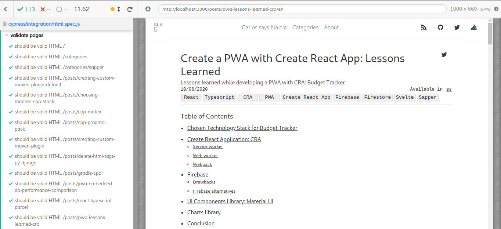
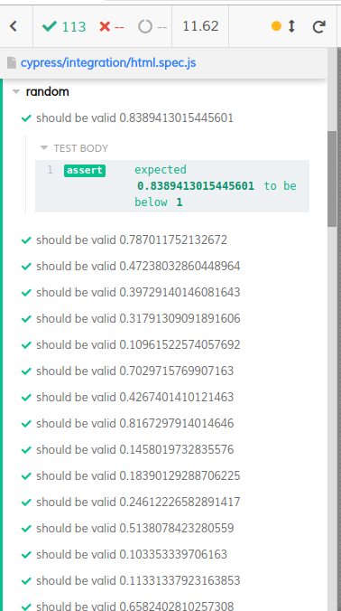

[Cypress](https://www.cypress.io/) is a testing framework for anything running on a web browser. I am using it to test this site and I've talked before about it in the post ["This is Sapper"](https://carlosvin.github.io/posts/this-is-sapper/en#_testing).

In this post I won't explain how to use [Cypress](https://www.cypress.io/), they have a pretty nice documentation: [Getting started with Cypress](https://docs.cypress.io/guides/getting-started/installing-cypress.html).

I will stick to the parameterized tests topic.

**Parameterized tests**: Also known as dynamic tests, it is an useful technique where you can specify an input dataset and the test case will be repeated for each element in the dataset.

## Explicit input data set

Since sometimes you can’t run the test for all the possible inputs, you can select a set of meaningful data to test.

Example checking that the relevant pages in the site have valid HTML syntax:

```javascript
describe('validate pages', () => {
    [ // <1>
        "/",
        "/categories",
        "/categories/sapper",
        "/posts/creating-custom-maven-plugin-default",
        "/posts/choosing-modern-cpp-stack",
        "/posts/cpp-mutex",
        "/posts/cpp-pragma-pack",
        "/posts/creating-custom-maven-plugin",
        "/posts/delete-html-tags-py-django",
        "/posts/gradle-cpp",
        "/posts/java-embedded-db-performance-comparison",
        "/posts/react-typescript-parcel",
        "/posts/pwa-lessons-learned-cra",
    ].forEach((url) => { // <2>
        it(`should be valid HTML ${url}`, () => { // <3>
            cy.visit(url)
            cy.htmlvalidate()
        })
    })
})
```

<1> List with relevant pages to validate  
<2> Iterate over the list of pages  
<3> Test case execution for selected page

### Test results



## Generated input data set

Instead of explicitly defining a data set, you can generate it, for example, creating a random data set.

Example checking that any generated random number is less than 0:

```javascript
describe('random', () => {
    const inputData = Array.from(Array(100)).map(x => Math.random()) // <1>
    inputData.forEach(x => { // <2>
        it(`should be valid ${x}`, () => { // <3>
            expect(x).to.be.lessThan(1)
        })
    })
})
```

<1> It generates an array of 100 random numbers  
<2> Iterate over the generated array  
<3> Test case execution

### Test results



> **Tip:** Please check the [cypress official examples to learn more about dynamic/parameterized testing](https://github.com/cypress-io/cypress-example-recipes/tree/master/examples/fundamentals__dynamic-tests).
