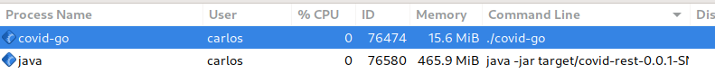

Lately I've been working with two different technology stacks almost in parallel, in both cases we were using them to develop [REST](https://en.wikipedia.org/wiki/Representational_state_transfer) services.

During this time I've come up with some conclusions and opinions I'd like to share.

A disclaimer, few months ago, I had several years of experience with Java and 0 days of professional experience with Golang.

## Actual project examples

Few months ago I created [an API to extract and structure COVID-19 data](https://covid-rest.appspot.com/docs) from [ECDC website](https://www.ecdc.europa.eu/en/publications-data/download-todays-data-geographic-distribution-covid-19-cases-worldwide). I developed it in [Spring Boot (REST)](https://spring.io/guides/gs/rest-service).

Few months later I had the luck of work on my first professional project in [Go](https://golang.org) and I decided to create a port of [the API to extract COVID-19 data](https://covid-rest.appspot.com/docs) in [Go](https://golang.org), just for learning and for fun.

Now we have two REST services, almost functionally identical, but developed in two different tech stacks, so we can easily compare some relevant aspects of both.

### Source code for the 2 REST services implementations

| [Java](https://www.java.com) + [Spring Boot (REST)](https://spring.io/guides/gs/rest-service) | [Go](https://golang.org) + [Gin framework](https://github.com/gin-gonic/gin) |
|---|---|
| [https://github.com/carlosvin/covid-rest](https://github.com/carlosvin/covid-rest) | [https://github.com/carlosvin/covid-rest-go](https://github.com/carlosvin/covid-rest-go) |

> **Note**: I actually created that [COVID-19 data REST API](https://covid-rest.appspot.com/docs) to be the data source for the [COVID19-Stats App](https://covid-stats-pwa.netlify.app), a [PWA](https://web.dev/progressive-web-apps) built with [Svelte](https://svelte.dev), but that's another topic.

## The Ecosystems

If you want to create a [REST](https://en.wikipedia.org/wiki/Representational_state_transfer) service just in plain Java you will have extra work to do, in Golang a little bit less. That's why we use framework, because they've already solved many common problems for us.

For this comparison I am going to use [Spring Boot (REST)](https://spring.io/guides/gs/rest-service) for [Java](https://www.java.com) and [Gin framework](https://github.com/gin-gonic/gin) for [Go](https://golang.org), but in both languages there are a lot of production ready nice options.

## Routing

### Go - Without framework

Go uses the concept of [HTTP](https://en.wikipedia.org/wiki/Hypertext_Transfer_Protocol) multiplexer or router. You can specify routes using patterns and link those routes to handlers. The router will decide which handler has to execute the request based on the path received.

#### router.go file

```go
package main

import (
 "log"
 "net/http"
)

func main() {
 router := http.NewServeMux()
 router.Handle("/redirect", http.RedirectHandler("https://carlosvin.github.io/", 307))
 router.HandleFunc("/hello", func(w http.ResponseWriter, r *http.Request) {
  w.Write([]byte("Hello world!"))
 })
 log.Println("Listening...")
 http.ListenAndServe(":3000", router)
}
```

Source code is already quite simple, but there might more complex routing use cases.

### Go - Gin Framework

Happily there are frameworks that help us to keep our base code simple, for example when we need to extract path parameters, which is quite common use case in [REST](https://en.wikipedia.org/wiki/Representational_state_transfer) [API](https://en.wikipedia.org/wiki/Application_programming_interface)s, we can use a routing library, I've used [Gorilla Mux](https://github.com/gorilla/mux) and [Gin framework](https://github.com/gin-gonic/gin) and I liked more [Gin framework](https://github.com/gin-gonic/gin).

#### [Full example](https://github.com/carlosvin/covid-rest-go/blob/master/main.go)

```go
import (
 "github.com/carlosvin/covid-rest-go/handlers"
 "github.com/carlosvin/covid-rest-go/readers"
 "github.com/gin-gonic/gin"
)

func main() {
 
 // ...

 r := gin.Default()
 r.GET("/countries", router.Countries)
 r.GET("/countries/:code", router.Country)
 r.GET("/countries/:code/dates", router.CountryDates)
 r.GET("/countries/:code/dates/:date", router.CountryDate)
 r.Run()

}
```

#### [And this is a handler example](https://github.com/carlosvin/covid-rest-go/blob/master/handlers/countries.go), the router.Countries one

```go
func (r *routerImpl) Countries(c*gin.Context) {
 c.JSON(200, r.countries())
}
```

### Java + Spring.io

The [Spring Boot (REST)](https://spring.io/guides/gs/rest-service) is based on the concept of Controller, it is implemented using annotations on the class and methods.

#### Controller Example

```java
@Validated
@RestController // (1)
@RequestMapping("/countries") // (2)
public class CountriesController {
 
 // Some source code is not shown, you can find the complete example in the repository 

 @GetMapping("/{country}/dates/{isoDateStr}")  // (3)
 public DateStatsDto getDateByCountry(@Size(min = 2, max = 2) @PathVariable String country, @Size(min = 10, max = 20) @PathVariable String isoDateStr) throws NotFoundException {
  return new DateStatsDto(service.getDate(country, DateUtils.convert(isoDateStr)));
 }

}
```

1. Declare the class as Controller so it is registered in [Spring Boot (REST)](https://spring.io/guides/gs/rest-service)
2. Controller base path definition
3. Handler definition for a nested path under the main controller path. [Spring Boot (REST)](https://spring.io/guides/gs/rest-service) makes easy to extract path variables defined in the route, you can directly use them as method arguments.

## Validations

### Go - Gin Framework Validation

[Gin framework](https://github.com/gin-gonic/gin) uses an external validation package [validator](https://godoc.org/github.com/go-playground/validator), besides that it is fully integrated with [Gin framework](https://github.com/gin-gonic/gin).

```go
type User struct {
 Name  string `validate:"required"` // (1)
 Email string `validate:"required,email"`
}

err := validate.Struct(user) // (2)
validationErrors := err.(validator.ValidationErrors) // (3)
```

1. The validation system uses [Go](https://golang.org) tags, it is not the same as [Java](https://www.java.com) annotations, but in the validation case, it works in pretty same way as annotations.
2. Executes the validation explicitly
3. Extracts validation errors

### Java + Spring.io Validation

You can enable the validation in the controller level, then in the handlers you can also specify the type of validation. Let's explain it using the previous example:

#### CountriesController.java Validation Example

```java
@Validated // (1)
@RestController
@RequestMapping("/countries")
public class CountriesController {
 
 // Some source code is not shown, you can find the complete example in the repository 

 @GetMapping("/{country}/dates/{isoDateStr}")
 public DateStatsDto getDateByCountry(
  @Size(min = 2, max = 2) @PathVariable String country, // (2)
  @Size(min = 10, max = 20) @PathVariable String isoDateStr) throws NotFoundException {
  return new DateStatsDto(service.getDate(country, DateUtils.convert(isoDateStr)));
 }

}
```

1. Declare the class as Controller so it is registered in [Spring Boot (REST)](https://spring.io/guides/gs/rest-service)
2. `@Size` validates that the input argument country has 2 characters

The validation system is more powerful than you can see in this code snippet, for example adding `@Valid` annotation opens the door to complex types validation.

### Filtering and Middleware

Different approaches, pretty much the same end result.

I will elaborate this topic in following days.

## Dependency injection / IoC

### [Spring IoC](https://docs.spring.io/spring-framework/docs/current/reference/html/core.html#beans-factory-collaborators)

[Spring IoC](https://docs.spring.io/spring-framework/docs/current/reference/html/core.html#beans-factory-collaborators) is the most complete and powerful systems I've ever used for [IoC](https://en.wikipedia.org/wiki/Inversion_of_control), actually, the first time I used Spring professionally was just to deal with [IoC](https://en.wikipedia.org/wiki/Inversion_of_control). It supports XML configuration files or [Java](https://www.java.com) annotations, I like annotations more, here a simple example from [Spring IoC](https://docs.spring.io/spring-framework/docs/current/reference/html/core.html#beans-factory-collaborators) documentation:

#### Spring IoC example

```java
@Repository
public class JpaMovieFinder implements MovieFinder { // (1)
    // implementation elided for clarity
}

//

public class SimpleMovieLister {

    private MovieFinder movieFinder;

    @Autowired // (2)
    public void setMovieFinder(MovieFinder movieFinder) {
        this.movieFinder = movieFinder;
    }

    // ...

}
```

1. `JpaMovieFinder` is instantiated by [Spring IoC](https://docs.spring.io/spring-framework/docs/current/reference/html/core.html#beans-factory-collaborators)
2. With `@Autowired` annotation [Spring IoC](https://docs.spring.io/spring-framework/docs/current/reference/html/core.html#beans-factory-collaborators) knows that has to inject `movieFinder` argument. It should be a class implementing `MovieFinder`

### Go

Neither [Go](https://golang.org) nor [Gin framework](https://github.com/gin-gonic/gin) has any [IoC](https://en.wikipedia.org/wiki/Inversion_of_control) solution, but you can still apply [Dependency Injection](https://en.wikipedia.org/wiki/Dependency_injection) technique to decouple your components and improve the testability of your system.

#### Dependency injection simple example in [Go](https://golang.org)

```go
package main

import "fmt"

// Greeter interface to greet the caller
type Greeter interface {
 greet()
}

type greeterHello struct{}

func (g *greeterHello) greet() { // (3)
 fmt.Println("Hello!")
}

type greeterHi struct{}

func (g *greeterHi) greet() { // (4)
 fmt.Println("Hi!")
}

// App Application representation
type App struct {
 greeters []Greeter // (1)
}

func (app *App) startup() {
 for _, v := range app.greeters {
  v.greet()
 }
}

func main() {
 greeters := []Greeter{ // (2)
  &greeterHello{},
  &greeterHi{},
  &greeterHello{}}

 app := &App{greeters}

 app.startup()
}
```

1. `App` accepts an array of `Greeter`
2. During `App` instantiation we pass different implementations of `Greeter`
3. Greeter implementation that prints **Hello!**
4. Greeter implementation that prints **Hi!**

It is more verbose, but there is an advantage, there is nothing hidden, everything is explicit and you have full control of instantiation order.

As soon as you use [Dependency Injection](https://en.wikipedia.org/wiki/Dependency_injection), I don't have any strong opinion about using [IoC](https://en.wikipedia.org/wiki/Inversion_of_control) system or doing [Dependency Injection](https://en.wikipedia.org/wiki/Dependency_injection) manually.

## Testing

### Unit tests

For unit tests there are no big differences.

[Go](https://golang.org) comes with a standard [library for testing and benchmarking](https://golang.org/pkg/testing/).

For [Java](https://www.java.com) there are many well-known unit testing frameworks, but Spring already has quite big support for [unit testing](https://docs.spring.io/spring-batch/docs/current/reference/html/testing.html).

### Integration tests

#### Go Integration Testing

There are no support for Integration Tests in [Go](https://golang.org), you will have to implement everything by yourself, although it is not difficult, [here you can find a simple example](https://kpat.io/2019/06/testing-with-gin/).

#### Spring

On the other hand, [Spring has a great testing support](https://docs.spring.io/spring-framework/docs/current/reference/html/testing.html).

To write integration tests for [REST](https://en.wikipedia.org/wiki/Representational_state_transfer) services, [MockMvc](https://spring.io/guides/gs/testing-web/) is really convenient.

I've used [MockMvc in the covid-rest project](https://github.com/carlosvin/covid-rest/blob/master/src/test/java/com/carlosvin/covid/CountriesControllerTest.java).

#### MockMvc code snippet from [CountriesControllerTest.java](https://github.com/carlosvin/covid-rest/blob/master/src/test/java/com/carlosvin/covid/CountriesControllerTest.java)

```java
@Autowired
private MockMvc mockMvc; // (1)
 
@Test
void getCountries() throws Exception {
 this.mockMvc.perform(get("/countries")) // (2)
   .andDo(print()).andExpect(status().isOk()) // (3)
   .andExpect(jsonPath("$.*", hasSize(144)))
   .andExpect(jsonPath("$.ES.confirmedCases",comparesEqualTo(9191)))
   .andExpect(jsonPath("$.ES.deathsNumber", comparesEqualTo(309)))
   .andExpect(jsonPath("$.ES.countryCode", comparesEqualTo("ES")))
   .andExpect(jsonPath("$.ES.countryName", comparesEqualTo("Spain")))
   .andExpect(jsonPath("$.ES.path", comparesEqualTo("/countries/ES")))
   .andExpect(jsonPath("$.VC.countryName", comparesEqualTo("Saint Vincent and the Grenadines")))
   .andDo(document("countries/list", preprocessResponse(prettyPrint(), new CropPreprocessor())));
}
```

1. The Spring test runner injects the MockMvc object.
2. We use MockMvc to call to the endpoint we have created.
3. Then we validate the endpoint response: status code and body.

## Performance

Besides the languages specific differences, the main difference is the performance. The CPU consumption in [Go](https://golang.org) is smaller, but about the memory the difference is really significant, **the order of 30 times smaller fingerprint**.

### Memory

Here I've found a surprising difference, just by checking the memory consumption in my laptop.

- [Gin framework](https://github.com/gin-gonic/gin) `15.6MB`
- [Spring Boot (REST)](https://spring.io/guides/gs/rest-service) `465.9MB`



### Speed

Following the [TechEmpower benchmarks](https://www.techempower.com/benchmarks/):

- [Gin framework](https://github.com/gin-gonic/gin) is in 193 position, 9.9%.
- [Spring Boot (REST)](https://spring.io/guides/gs/rest-service) is in 284 position, 4%.

Following the [The Benchmarker results](https://github.com/the-benchmarker/web-frameworks):

- [Gin framework](https://github.com/gin-gonic/gin): position 33.
- [Spring Boot (REST)](https://spring.io/guides/gs/rest-service): position 68.

## Conclusions

If I were you, I'd choose [Go](https://golang.org) if:

- If you value the explicit over implicit, keep in mind that there is a cost, you will most likely have to write more lines of code.
- If you value the simplicity, [Go](https://golang.org) has a quite reduced set of keywords, which reduces the learning curve and simplifies the code reviews.
- If RAM memory usage is critical for your project, actually I'd just keep away from [Spring Boot (REST)](https://spring.io/guides/gs/rest-service).
- If the project you are going to work on is a distributed system, specially if it is based on [HTTP](https://en.wikipedia.org/wiki/Hypertext_Transfer_Protocol).
