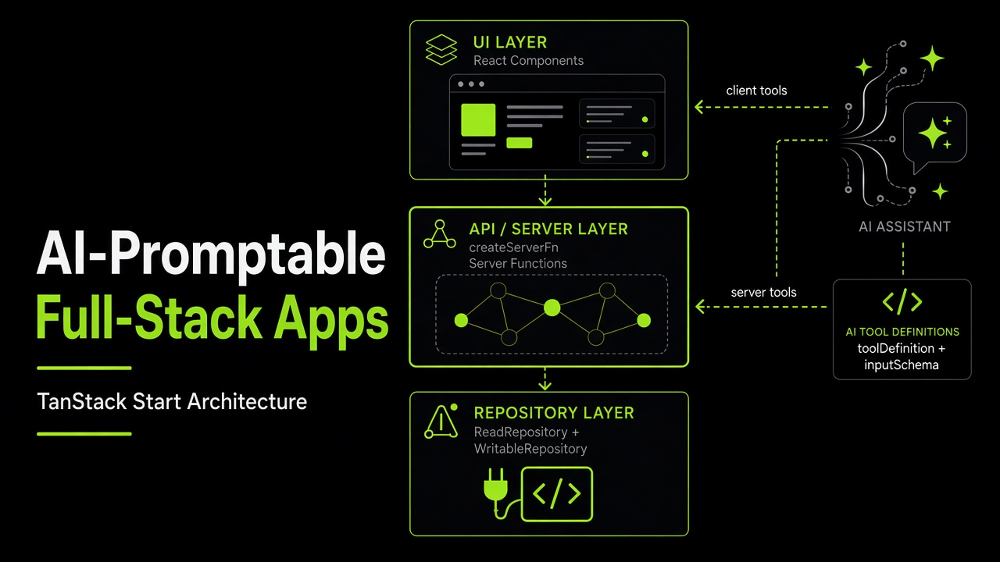

Every new full-stack React app used to restart the same plumbing: JWT auth, database access, UI shell, TanStack AI, observability, and server boundaries. The business logic was never the expensive part.

It started with internal tools at [MongoDB](https://www.mongodb.com), but the patterns apply to any web app. We extracted them into a [TanStack Start template](https://github.com/carlosvin/tanstack-fullstack-ai-template) that is **promptable by design**: one Repository interface, the same server functions for UI and AI, and an **Agent Skill** that encodes the contract so coding agents don't invent a second architecture.

- [🔗 GitHub Repository](https://github.com/carlosvin/tanstack-fullstack-ai-template)
- [🚀 Live Demo](https://fullstack-promptable-app-example.netlify.app)

> **Note:**  
> This post tracks architecture skill v1.31 from the template. The skill is the contract; this article is the tour.

## The Problem

Most full-stack apps share the same foundation:

- CRUD behind a database
- Auth and audit from request headers
- An accessible UI with dark/light mode
- Safe server/client splits
- Logging, error tracking, tracing
- An AI assistant that can query, navigate, and mutate with the same rules as the UI

Without a shared contract, every repo reinvented those pieces slightly differently. Agents then followed the local drift.

## The Chosen Tech Stack

[TanStack Start](https://tanstack.com/start) is the fixed core: **Start**, **Router**, and **AI**.

- **Server functions** (`createServerFn`) as type-safe RPC
- **File-based routing** with [TanStack Router](https://tanstack.com/router) (see our [production router conventions](@/tanstack-router-opinionated-conventions-production-react-apps.md))
- **SSR** via Nitro
- **Middleware** that builds typed request context with `next({ context })`

Everything else is swappable behind interfaces: database, AI provider, observability, UI kit, schema library. The reference app uses [Mantine](https://mantine.dev/), [`lucide-react`](https://lucide.dev/), [TanStack AI](https://tanstack.com/ai), [Zod](https://zod.dev/), [Biome](https://biomejs.dev/), [Vitest](https://vitest.dev/), and [Playwright](https://playwright.dev/). Those concrete packages live in the companion skill `reference-tech-stack`, not in the architecture contract.

## Architecture: One Interface Per External

**Every external service sits behind an interface.** The database, AI adapter, and observability layer can change without touching routes or tools.



*Runtime flow: server tools call the same `createServerFn` endpoints as loaders and UI handlers; client tools (navigation, cache invalidation) run in the browser. Data access is a single `Repository` — never reached directly by AI tools.*

### One `Repository`, not read vs write

Auth for writes lives on **POST server functions** (`requireAuthMiddleware`), not on a second repository type. Reads and writes share one interface that speaks **repository-layer types only**:

```typescript
export interface TraceabilityContext {
  createdBy?: string
  lastModifiedBy?: string
}

export interface Repository {
  getTasks(filter?: TaskRepoFilter): Promise<TaskRepo[]>
  getTask(taskId: string): Promise<TaskRepo | null>
  getDistinctValues(field: DistinctValueField): Promise<string[]>
  getUserProfile(email: string): Promise<UserProfileRepo | null>
  getUserAccess(email: string): Promise<UserAccessRepo | null>
  createTask(input: TaskRepoInput, trace?: TraceabilityContext): Promise<TaskRepo>
  updateTask(taskId: string, input: Partial<TaskRepoInput>, trace?: TraceabilityContext): Promise<TaskRepo | null>
  deleteTask(taskId: string): Promise<boolean>
}
```

Two implementations ship with the template:

1. **SeedRepository** — in-memory sample data for local dev and CI
2. **MongoRepository** — production MongoDB

A factory picks one from `MONGODB_URI` (or explicit `REPOSITORY_TYPE`). You do not need a database to start.

An overlay repository (read-only upstream plus sparse user overrides) is an **optional** composition pattern in the skill — not a core read/write factory split.

### Traceability on writes

Mutations take a `TraceabilityContext` built from the auth ticket (`createWriteTrace` / `updateWriteTrace`), not a bare email argument. Implementations persist `createdBy` / `lastModifiedBy` on the entity so UI and AI writes stay auditable.

## App Boundaries and Type Safety

This is the part the skill now stresses most: **untrusted values become typed only at trust boundaries**. After that, TypeScript keeps the interior honest.

```
URL search  →  validateSearch  →  loader  →  tools schema  →  server fn
                                                      ↓ Schema.parse()
                                              repository schema  →  Repository
                                                      ↓ Schema.parse()
                                              tools schema  →  UI or AI
```

### Three schema layers

1. **Repository** (`repository.ts`): DB-shaped documents. No `.describe()` required. Types inferred from the validator.
2. **Tools / server functions** (`schemas.ts`): API-shaped, shared by `createServerFn` `.inputValidator(Schema)` and AI `toolDefinition({ inputSchema })`. Field `.describe()` (and optional `.meta({ unit, format, title })`) is what the model sees.
3. **Router search**: local `validateSearch` schemas. That **is** the trust boundary for URL params.

UI and AI consume **tools-layer types only**. They never import repository schemas.

### Parse at the edge, infer inside

Layer switches happen in mapper functions. The last step is always `Schema.parse()`:

```typescript
// Inbound: tools layer → repository layer
function toRepoCreateInput(tool: z.infer<typeof TaskCreateToolSchema>): TaskRepoInput {
  return TaskRepoInputSchema.parse({
    title: tool.title,
    status: tool.status,
  })
}

// Outbound: repository row → tools layer (UI loaders and AI tools)
function toToolTask(row: TaskRepo): z.infer<typeof TaskToolSchema> {
  return TaskToolSchema.parse({
    id: row.id,
    title: row.title,
    status: row.status,
  })
}
```

The same rule applies to other untrusted edges: DB documents and external API JSON in repository implementations, `createServerFn` input, AI tool args, env (companion `observability-and-env`), and widget `onChange` values typed as bare `string`. Parse with the **same schema** — do not add `Array.find` helpers that duplicate enums.

### TypeScript after parse

Once a value has crossed a boundary, keep **schema-inferred types** end-to-end. Prefer `satisfies`, `as const` tuples, discriminated unions, and exhaustive `switch` with `assertNever`. Do not widen back to `string` / `any` / `Record<string, unknown>` and re-parse with a homemade guard.

```typescript
type TaskStatus = 'pending' | 'done'

const STATUS_LABEL = {
  pending: 'Pending',
  done: 'Done',
} as const satisfies Record<TaskStatus, string>

function labelForStatus(status: TaskStatus): string {
  switch (status) {
    case 'pending':
      return STATUS_LABEL.pending
    case 'done':
      return STATUS_LABEL.done
    default:
      return assertNever(status)
  }
}
```

Runtime validation checks the edges. TypeScript checks the interior. Hand-written interfaces define **behavior** (`Repository`, `AIAdapterService`) — not ad-hoc JSON shapes.

> **Why Zod?**  
> [ArkType](https://arktype.io/) and Valibot are valid alternatives. The skill is validator-agnostic: pick **one** library per app. The reference template uses Zod for ecosystem reach; swap by keeping the same layer and parse boundaries.

## Server Execution Boundaries

Route **loaders are isomorphic**: they run on the server during SSR **and** in the browser on SPA navigations. A route file is not server-only code.

Keep routes thin (`createFileRoute`, `validateSearch`, `loaderDeps`, `loader`, `component`). Loaders only call exported `createServerFn` endpoints from `src/services/api/serverFns.ts`. Database clients, repo factories, and crypto live in `*.server.ts` (or `import '@tanstack/react-start/server-only'`). Internal singletons that must never be RPC-callable use `createServerOnlyFn`, not `createServerFn`.

Vite `importProtection` with `behavior: 'error'` fails the build if drivers or secrets leak into the client bundle.

## Request Context

Middleware validates at the edge, then `next({ context })`. Start **infers** `context` from the chain. Handlers read `context.accessTicket` directly — no `as AuthContext`, no runtime "is this field present?" helpers.

Auth middleware decodes the JWT, loads profile and roles via `getRepository()`, and builds an **`AccessTicket`** (identity, roles, guards such as `requireTaskCreator`). Mutations chain `.middleware([requireAuthMiddleware, invalidateMiddleware])`. Queries stay unauthenticated by default.

`invalidateMiddleware` tells the client to `router.invalidate()` after a successful POST. Components do not invalidate by hand.

Authorization is **server-enforced**. Hiding a button is not enough.

## Promptable by Design

TanStack AI tools call the **same server functions** as loaders and UI handlers:

```typescript
const getTasksToolDef = toolDefinition({
  name: 'getTasks',
  description: 'Get all tasks with optional filters. Supports status, priority, assignee, and search.',
  inputSchema: TaskFilterSchema,
})

export const getTasksTool = createSafeServerTool(getTasksToolDef, async (args) =>
  getTasks({ data: TaskFilterSchema.parse(args) }),
)
```

`createSafeServerTool` turns `HttpError` 401/403/404 into `{ error, code }` so the agent can explain "you need to log in" instead of crashing the loop.

The skill requires **full tool coverage**: every repository method becomes a server tool, plus distinct-value tools for real filter options, plus client tools `navigate` and `invalidateRouter`. Chat is gated on `getAIAvailability()`. The client sends `browserContext` (timezone, locale, current path); the server injects it into the system prompt with a navigation manifest from the router. Every `chat()` call sets `agentLoopStrategy: maxIterations(10)`.

## URL-as-State

Filters, tabs, and selections live in validated search params with `loaderDeps` so loaders refetch only when those keys change. A project `Link` wrapper defaults to `search: true` so query state survives navigation. Shared `beforeLoad` and expensive reads belong on the **parent** layout; children consume parent loader data.

Free-text search uses an uncontrolled input and a **debounced** navigate. Discrete filters navigate immediately.

## Agent Skills

The contract is published from the template so agents don't have to infer it from scattered READMEs:

```bash
npx skills add carlosvin/tanstack-fullstack-ai-template --list

npx skills add carlosvin/tanstack-fullstack-ai-template --skill tanstack-promptable-fullstack-app-template
npx skills add carlosvin/tanstack-fullstack-ai-template --skill observability-and-env
npx skills add carlosvin/tanstack-fullstack-ai-template --skill reference-tech-stack
```

1. **`tanstack-promptable-fullstack-app-template`** — vendor-agnostic architecture: one repository, three schema layers, trust-boundary parsing, isomorphic loaders, AI tool parity, URL-as-state, middleware-inferred context.
2. **`observability-and-env`** — startup-parsed env, `webServerEnv` vs `shellSession`, logging and error-tracking bootstrap.
3. **`reference-tech-stack`** — this template's package defaults (Zod, Mantine, MongoDB, jose, Biome, Vitest, Playwright, Netlify).

Day-to-day ops (UI kit, chat wiring, test commands) live in the template's `AGENTS.md`. The skill is what agents must not break.

## Getting Started

```bash
git clone https://github.com/carlosvin/tanstack-fullstack-ai-template.git my-app
cd my-app
pnpm install
pnpm dev
```

Open [http://localhost:3000](http://localhost:3000). Seed data is enough for dashboard, lists, detail, CRUD, and the AI drawer. No database, API keys, or env vars required.

```bash
pnpm format && pnpm lint && pnpm test && pnpm test:e2e && pnpm build
```

When you connect real services, the main switches are:

| Variable | Purpose |
| -------- | ------- |
| `MONGODB_URI` | Swap seed repository for MongoDB |
| `AZURE_OPENAI_API_KEY`, `AZURE_OPENAI_ENDPOINT`, `AZURE_OPENAI_DEPLOYMENT` | Enable chat (or deploy on Netlify AI Gateway) |
| `SENTRY_DSN` | Error and performance tracking |
| `AUTH_HEADER_NAME` | JWT header (default: `Authorization`) |

Env is parsed **once at startup** into `webServerEnv` and a browser-safe `shellSession`. The root loader exposes only `getBrowserShellSession` — never `serverEnv` or `window.__ENV__`.

## Extending the Template

Adding a domain entity is still a short, repeatable path:

1. **Schemas** — repository + tools + search layers; mappers that end in `Schema.parse()`.
2. **Repository** — methods on `Repository` with `TraceabilityContext` on writes; implement seed and production.
3. **Server functions** — GET queries; POST mutations with `requireAuthMiddleware` and `invalidateMiddleware`.
4. **AI tools** — `toolDefinition` + `createSafeServerTool` for every server function; client navigate/invalidate in the chat shell.
5. **Routes** — thin files, `validateSearch`, `loaderDeps`, parent layouts for shared work.
6. **Tests** — mapper/unit tests and Playwright against seed data.

## Conclusion

The template is a **starting point**, not another framework. The current skill is simpler than the first write-up of this architecture: one `Repository`, parse at the app's edges, keep inferred types on the inside, and let AI tools share the same server functions as the UI.

- 📁 [GitHub Repository](https://github.com/carlosvin/tanstack-fullstack-ai-template)
- 🚀 [Live Demo](https://fullstack-promptable-app-example.netlify.app)

---

*Built with TanStack Start, Mantine, TanStack AI, MongoDB, Zod, Sentry, Vitest, Playwright, and Biome.*
