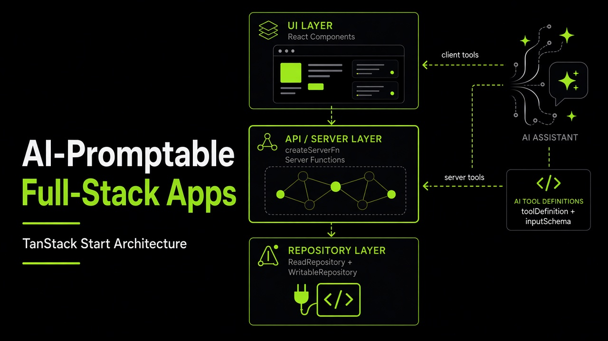

Every new full-stack React app used to restart the same plumbing: auth, database access, a UI shell, an AI assistant, and a safe split between server and browser. The business logic was never the expensive part.

It started with internal tools at [MongoDB](https://www.mongodb.com). The patterns apply to any web app. We extracted them into a [TanStack Start template](https://github.com/carlosvin/tanstack-fullstack-ai-template) and wrote the architecture down as an **Agent Skill**. The skill is the contract. The task app in that repository is one example of the contract.

- [🔗 GitHub Repository](https://github.com/carlosvin/tanstack-fullstack-ai-template)
- [🚀 Live Demo](https://fullstack-promptable-app-example.netlify.app)

> **Note:**  
> This post teaches `tanstack-promptable-fullstack-app-template` (v1.31). Day-to-day setup lives in the template's `AGENTS.md`. Concrete packages live in the companion skill `reference-tech-stack`.

## The Problem

Most full-stack apps share the same foundation:

- Data access behind a database
- Auth and request context from headers
- An accessible UI with dark and light mode
- A boundary that keeps drivers and secrets out of the browser
- An AI assistant that can query, navigate, and mutate with the same rules as the UI

Without a shared contract, every repo reinvented those pieces. Coding agents then copied whichever local variant they found.

## What the skill fixes, and what it leaves open

The skill fixes the TanStack pieces: **Start**, **Router**, and **AI**. Server functions, middleware, file routes, `validateSearch`, loaders, and `chat()` / tools are part of the contract. Current library docs come from `@tanstack/cli`, not from memory.

Everything else stays behind an interface: database, auth mechanism, AI provider, observability, UI kit, and the schema library. Pick **one** validator per app (the samples below use Zod) and use it for router search, server-function inputs, and AI tool schemas.



*UI handlers and server tools call the same `createServerFn` endpoints. Client tools (navigation, cache invalidation) run in the browser. Data access goes through a `Repository`.*

## The repository

External services are reached through interfaces. For data, that interface is `Repository`. Its methods speak **repository-layer types** only. Authorization for writes lives on POST server functions (`requireAuthMiddleware`).

The reference app's interface is a task list. A different product keeps the same shape and changes the methods:

```typescript
export interface Repository {
  getTasks(filter?: TaskRepoFilter): Promise<TaskRepo[]>
  getTask(taskId: string): Promise<TaskRepo | null>
  getDistinctValues(field: DistinctValueField): Promise<string[]>
  getUserProfile(email: string): Promise<UserProfileRepo | null>
  getUserAccess(email: string): Promise<UserAccessRepo | null>
  createTask(input: TaskRepoInput): Promise<TaskRepo>
  updateTask(taskId: string, input: Partial<TaskRepoInput>): Promise<TaskRepo | null>
  deleteTask(taskId: string): Promise<boolean>
}
```

The reference app ships two implementations of that interface: an in-memory **SeedRepository** for local dev and CI, and a **MongoRepository** for production. A factory selects one. Swapping the database means a new implementation and a factory change. Routes, server functions, and AI tools stay put.

Hand-written interfaces describe **behavior** (`Repository`, `AIAdapterService`, `ObservabilityService`). JSON shapes come from schemas.

## App boundaries and type safety

Untrusted values become typed only at a trust boundary. After that, the rest of the app keeps the inferred type.

```
URL search  →  validateSearch  →  loader  →  tools schema  →  server fn
                                                      ↓ Schema.parse()
                                              repository schema  →  Repository
                                                      ↓ Schema.parse()
                                              tools schema  →  UI or AI
```

### Three schema layers

1. **Repository** (DB-shaped), in `repository.ts`. Types are inferred. Field descriptions are optional here.
2. **Tools / server functions** (API-shaped), in `schemas.ts`. One schema is shared by `createServerFn` `.inputValidator(Schema)` and AI `toolDefinition({ inputSchema })`. `.describe()` is the text the model sees. `.meta({ unit, format, title })` is for structured hints only.
3. **Router search** (URL-shaped). A local `validateSearch` schema. That schema is the trust boundary for query params. Fields are usually optional, because URLs are partial.

UI and AI import tools-layer types only.

### Parse at the edge

Each untrusted edge uses the same validator:

- Database documents and external API JSON are parsed with the **repository** schema inside the repository implementation.
- URL params go through `validateSearch`.
- Server-function bodies and AI tool arguments go through the **tools** schema.
- A widget `onChange` typed as `string` is parsed with that same schema.

Layer changes happen in mapper functions. The last step is `Schema.parse()`:

```typescript
function toRepoCreateInput(tool: z.infer<typeof TaskCreateToolSchema>): TaskRepoInput {
  return TaskRepoInputSchema.parse({
    title: tool.title,
    status: tool.status,
  })
}

function toToolTask(row: TaskRepo): z.infer<typeof TaskToolSchema> {
  return TaskToolSchema.parse({
    id: row.id,
    title: row.title,
    status: row.status,
  })
}
```

Parsing inbound input and returning a raw database row skips half the boundary. A second parser (`Array.find` on a tuple, a homemade guard, a cast) for the same enum duplicates the schema.

### Types after the boundary

Once a value is parsed, carry the inferred type through handlers, tools, and components. Closed sets start as an `as const` tuple, become a schema enum, and infer the union. A label map then has to cover every member:

```typescript
const TASK_STATUSES = ['pending', 'done'] as const

const TaskStatusSchema = z.enum(TASK_STATUSES).describe('Current status')
type TaskStatus = z.infer<typeof TaskStatusSchema>

const labelForStatus = {
  pending: 'Pending',
  done: 'Done',
} as const satisfies Record<TaskStatus, string>

function label(status: TaskStatus) {
  return labelForStatus[status]
}
```

Widening that union back to `string`, `any`, or `Record<string, unknown>` throws away the boundary you just paid for.

> **Why Zod in the samples?**  
> The skill is validator-agnostic. [ArkType](https://arktype.io/) and Valibot are valid if the three layers and the `parse` boundaries stay. The reference app uses Zod.

## Where code is allowed to run

Route loaders are **isomorphic**. They run on the server during SSR and in the browser on client navigations. A route file can ship to the client bundle.

Route files stay thin: `createFileRoute`, `validateSearch`, `loaderDeps`, `loader`, and `component`. Page UI lives in `src/components/`. The loader only calls a server function:

```typescript
export const Route = createFileRoute('/tasks/')({
  validateSearch: TasksSearchSchema,
  loaderDeps: ({ search }) => search,
  loader: ({ deps }) => getTasks({ data: deps }),
})
```

```typescript
export const getTasks = createServerFn({ method: 'GET' })
  .inputValidator(TaskFilterSchema.optional())
  .handler(async ({ data: filter }) => {
    const repoFilter = filter ? TaskRepoFilterSchema.parse(filter) : undefined
    const rows = await getRepository().getTasks(repoFilter)
    return rows.map(toToolTask)
  })
```

Database clients, repository factories, and crypto live in `*.server.ts` (or start with `import '@tanstack/react-start/server-only'`).

| Primitive | Use when |
| --------- | -------- |
| `createServerFn` | A loader, a mutation, or an AI tool must call the server over RPC |
| `createServerOnlyFn` | An internal singleton, such as a DB client, that must never be an RPC endpoint |

`tanstackStart({ importProtection: { behavior: 'error' } })` fails the build when a driver or secret package reaches the client graph.

## Request context

Middleware is where external input becomes context: the auth header, env, repository lookups that enrich the user. It calls `next({ context })`. From there, Start **infers** `context` from the middleware chain. Handlers read `context.accessTicket` directly.

Auth middleware decodes the JWT, loads profile and access through `getRepository()`, and builds an **`AccessTicket`** (identity, roles, guards). POST mutations chain `.middleware([requireAuthMiddleware, invalidateMiddleware])`. GET queries stay open unless the handler itself requires a ticket. `invalidateMiddleware` tells the client to `router.invalidate()` after a successful POST, so components do not invalidate by hand.

Handlers return data or throw `HttpError`. Callers normalize that differently per surface:

- UI code uses `processResponse` and renders `{ data, error }`.
- AI tools use `createSafeServerTool`, which turns 401, 403, and 404 into `{ error, code }` so the model can explain the failure.

Hiding a button is not authorization. The server handler is.

Env is parsed **once** at startup into `webServerEnv` and a browser-safe `shellSession`. The root loader exposes only `getBrowserShellSession`. The recipe for env schemas, logging, and error tracking is the companion skill `observability-and-env`.

## One code path for the UI and the AI

A server function that the UI can call is a server function the assistant can call. The tool reuses the tools-layer schema:

```typescript
const getTasksToolDef = toolDefinition({
  name: 'getTasks',
  description: 'Get tasks with optional filters.',
  inputSchema: TaskFilterSchema,
})

export const getTasksTool = createSafeServerTool(getTasksToolDef, async (args) =>
  getTasks({ data: TaskFilterSchema.parse(args) }),
)
```

Coverage is part of the contract:

- Every repository method has a server tool.
- Enum-like filters get a distinct-values tool, so the model filters on real data.
- `navigate` and `invalidateRouter` are client tools. They run in the browser.
- The root loader checks `getAIAvailability()` and mounts chat only when it is configured.
- The client sends `browserContext` (timezone, locale, current path). `buildSystemPrompt` combines that with the auth ticket and with route structure derived from the router.
- Every `chat()` call sets `agentLoopStrategy: maxIterations(10)` explicitly.

Assistant replies render as Markdown, including tables and code. How the reference app renders that Markdown is in `AGENTS.md`.

## URL state and navigation

Filters, tabs, and selections live in validated search params. `loaderDeps` names the search fields that should refetch the loader, so unrelated URL changes do not bust the cache.

Two navigation decisions ship together:

- A project `Link` wrapper whose default is `search: true`, used for every internal link, so query state survives navigation.
- Router defaults: `defaultStaleTime`, `defaultPreload: 'intent'`, `defaultPreloadStaleTime: 0`, `scrollRestoration: true`, and `notFoundComponent`.

Shared `beforeLoad` guards and expensive reads belong on the **parent** layout. Child routes read that loader data with `getRouteApi` or `useLoaderData({ from })`.

## The skills

```bash
npx skills add carlosvin/tanstack-fullstack-ai-template --list

npx skills add carlosvin/tanstack-fullstack-ai-template --skill tanstack-promptable-fullstack-app-template
npx skills add carlosvin/tanstack-fullstack-ai-template --skill observability-and-env
npx skills add carlosvin/tanstack-fullstack-ai-template --skill reference-tech-stack
```

1. **`tanstack-promptable-fullstack-app-template`** is this post: interfaces, three schema layers, trust boundaries, isomorphic loaders, AI tool parity, URL state, and middleware-inferred context.
2. **`observability-and-env`** is startup env, `webServerEnv` versus `shellSession`, logging, and error-tracking bootstrap.
3. **`reference-tech-stack`** is the reference app's packages: Zod, Mantine, MongoDB, jose, Biome, Vitest, Playwright, Netlify.

`AGENTS.md` is the handbook for UI, chat wiring, and the validation commands. The architecture skill is what an agent must not break.

## The reference app

```bash
git clone https://github.com/carlosvin/tanstack-fullstack-ai-template.git my-app
cd my-app
pnpm install
pnpm dev
```

Open [http://localhost:3000](http://localhost:3000). Seed data is enough for the dashboard, lists, detail, CRUD, and the AI drawer.

```bash
pnpm format && pnpm lint && pnpm test && pnpm test:e2e && pnpm build
```

Wiring that example to real services is environment, not architecture:

| Variable | Purpose |
| -------- | ------- |
| `MONGODB_URI` | Use MongoDB instead of the seed repository |
| `AZURE_OPENAI_API_KEY`, `AZURE_OPENAI_ENDPOINT`, `AZURE_OPENAI_DEPLOYMENT` | Enable chat |
| `SENTRY_DSN` | Error and performance tracking |
| `AUTH_HEADER_NAME` | JWT header (default: `Authorization`) |

## Adding a domain entity

The skill's implementation order is the same for every entity:

1. **Schemas** for the repository layer, the tools layer, and route search. Mappers end in `Schema.parse()`.
2. **Repository** methods on the interface, with a seed implementation and a production implementation.
3. **Server functions** in `serverFns.ts`. GET for reads. POST with `requireAuthMiddleware` and `invalidateMiddleware` for writes. Both sides share the tools-layer validator.
4. **AI tools**: `toolDefinition` plus `createSafeServerTool` for each server function, and the client navigate / invalidate tools in the chat shell.
5. **Routes** with `validateSearch`, `loaderDeps`, and loaders. Shared work goes on the parent layout.
6. **Tests** for the mappers and end-to-end flows against the seed repository.

## Conclusion

The template is a starting point. The skill is the part worth keeping when the task domain is replaced: a `Repository` for data access, parse at the edges, inferred types on the inside, and AI tools that call the same server functions as the UI.

- 📁 [GitHub Repository](https://github.com/carlosvin/tanstack-fullstack-ai-template)
- 🚀 [Live Demo](https://fullstack-promptable-app-example.netlify.app)

---

*Built with TanStack Start, Mantine, TanStack AI, MongoDB, Zod, Sentry, Vitest, Playwright, and Biome.*
